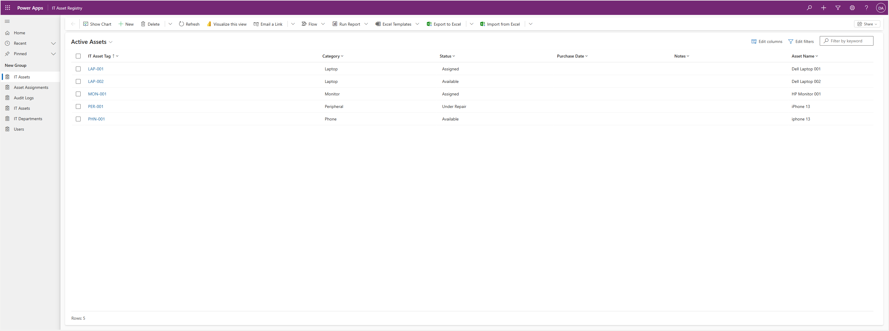
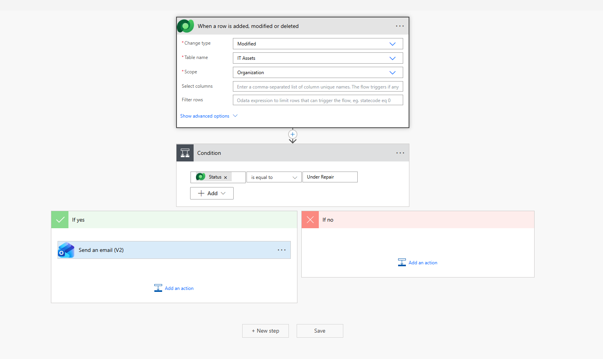
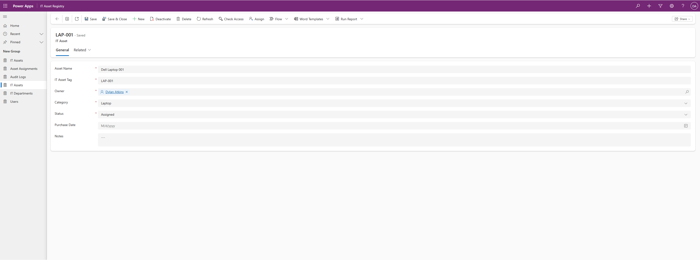
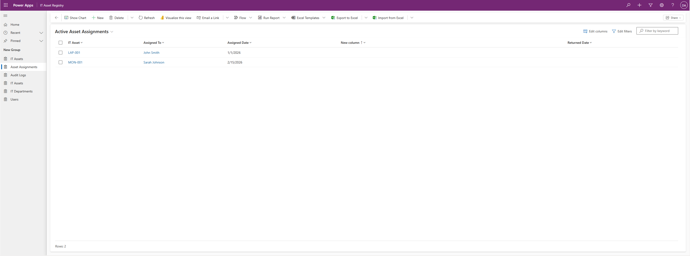

# IT Asset Management App

A model-driven Power App for managing IT assets, assignments, and audit logs across departments. Built as a portfolio project to demonstrate Microsoft Power Platform development skills.

## Overview

This app allows an IT team to track assets across their lifecycle — from procurement through assignment, repair, and retirement. It uses Microsoft Dataverse as the data layer and includes an automated Power Automate alert when an asset is flagged for repair.

## Features

- Track IT assets by category, status, and asset tag
- Assign assets to users and departments
- Log asset activity with an audit trail
- Automated email alert when an asset status changes to "Under Repair"

## Tech Stack

- **Microsoft Power Apps** — Model-driven app
- **Microsoft Dataverse** — Data layer
- **Power Automate** — Automated status change alert

## Data Model

### IT Asset
| Column | Type | Required |
|--------|------|----------|
| Asset Name | Text | Yes |
| IT Asset Tag | Text | Yes |
| Category | Choice (Laptop, Monitor, Phone, Peripheral, Other) | Yes |
| Status | Choice (Available, Assigned, Under Repair, Retired) | Yes |
| Purchase Date | Date | No |
| Notes | Multiline Text | No |

### IT Department
| Column | Type | Required |
|--------|------|----------|
| Name | Text | Yes |
| Location | Text | No |

### User
| Column | Type | Required |
|--------|------|----------|
| Name | Text | Yes |
| Email | Text | Yes |
| Department | Lookup → IT Department | No |

### Asset Assignment
| Column | Type | Required |
|--------|------|----------|
| IT Asset | Lookup → IT Asset | Yes |
| Assigned To | Lookup → User | Yes |
| Assigned Date | Date | Yes |
| Returned Date | Date | No |

### Audit Log
| Column | Type | Required |
|--------|------|----------|
| IT Asset | Lookup → IT Asset | Yes |
| Performed By | Lookup → User | Yes |
| Action | Choice (Created, Assigned, Returned, Status Changed, Retired) | Yes |
| Timestamp | Date/Time | Yes |
| Notes | Text | No |

## Power Automate Flow

**Asset Status Change Alert** — triggers when an IT Asset record is modified. If the Status field equals "Under Repair", an email notification is sent to the IT administrator.

## Screenshots

### Asset Record

### Asset Assignments

## Project Context

This is a portfolio project built to demonstrate Power Platform development skills including model-driven app design, Dataverse data modelling, table relationships, and Power Automate cloud flows. It mirrors the type of IT asset tracking solutions commonly built in enterprise and government environments.
